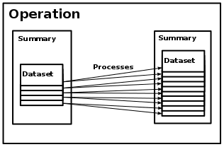
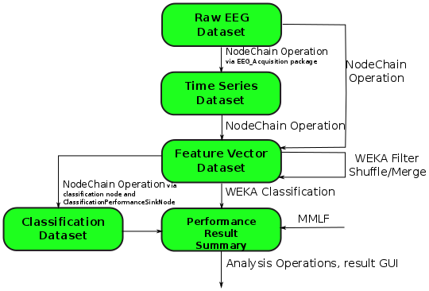

.. _overview:

Overview
========

pySPACE is an interface, which automatizes data handling, data processing
and parallelization.
So the user defines :ref:`datasets`, how to :ref:`process<processing>` the data
in which :ref:`modality`.
It is also specified,
where the relevant resources are with another :ref:`configuration file<conf>`.

The task of pySPACE is to define the different components and how to access them,
loading of the :ref:`configuration files<spec>`, and :ref:`datasets`,
and finally executing the defined :ref:`process<processing>`
with the desired :ref:`modality`.
So the :ref:`process transforms the data <data_transformation>`, depending on
the choice of the user.

.. _datasets:

Resources
---------

Data in pySPACE has several levels of granularity, which makes it difficult
to find proper names for each level.

The ordering is:

    :storage:   the folder with all the data, defined as described in :ref:`conf`
    :summary:   a summary of all the datasets with same type and fitting all to
                one topic
    :dataset:   One data recording
    :base data: One component/sample of the dataset
    :...:       Base data could be divided in components belonging to one
                special sensor and/or timestamp

Datasets
++++++++

Datasets are structured in :mod:`~pySPACE.resources.dataset_defs`.
Datasets should comprise data that originates from the same source and type
(:mod:`~pySPACE.resources.data_types`),
i.e. the process that generated them should be the same. 
Several :mod:`~pySPACE.resources.dataset_defs`, that originate from different sources,
can be combined together into a **summary**.
A typical example of a :mod:`~pySPACE.resources.dataset_defs` is an EEG
measured from one subject in one session. 
In contrast, a *summary* can contain the measurements of several different subjects or from different sessions.
Both :mod:`~pySPACE.resources.dataset_defs` and *summaries* consist
of the actual data and some meta data stored in the file: ``metadata.yaml``.
:mod:`~pySPACE.resources.dataset_defs` have a type e.g.
:mod:`~pySPACE.resources.dataset_defs.time_series` or
:mod:`~pySPACE.resources.dataset_defs.feature_vector`.
**The metadata is crucial**, because it tells the software,
which type of data is stored in which format.
The format is also important to know, since different formats require
totally different loading algorithms, e.g. comma separated values without heading
and empty space separated values with heading.
For the relevant types, there is a direct mapping between
:mod:`~pySPACE.resources.dataset_defs` types and
the :mod:`~pySPACE.resources.data_types`, they contain.

Example of a FeatureVectorDataset metadata.yaml
...............................................

.. code-block:: yaml

  type: feature_vector
  author: Max Mustermann
  date: '2009_4_5'
  node_chain_file_name: example_flow.yaml
  input_collection_name: input_collection_example
  classes_names: [Standard, Target]
  feature_names: [feature1, feature2, feature3]
  num_features: 3
  parameter_setting: {__LOWER_CUTOFF__: 0.1, __UPPER_CUTOFF__: 4.0}
  runs: 10
  splits: 5
  storage_format: [arff, real]
  data_pattern: data_run/features_sp_tt.arff

Summaries
+++++++++

A summary inherits the type of the datasets it comprises,
i.e. it must be homogeneous containing only one type of dataset.
The structure is quite easy,
because it is normally only one folder,
containing folders with the different :mod:`~pySPACE.resources.dataset_defs`.
So there is no special type or implementation therefore,
but only the folder name in the configuration files and in the program.
So *input_path* and *result_dir* always refer to a summary in the code.

.. _processing:

Processing
----------

Processing describes any kind of computation that transforms one kind of data
into another. In pySPACE, there exist different concepts of processing for
different levels of granularity mostly dependent on the :ref:`datasets`.
Predefined processing, which only concatenates other processing is implemented
in the :mod:`~pySPACE.environments.chains` module.
The other components, where the programmer might integrate new processing
algorithms are defined in the :mod:`~pySPACE.missions` module with an
automatic integration into the interface and documentation.

The main categories are:

    :operation chain:
                    Concatenation of operations, with summaries as input,
                    output and intermediate results
    :operation:     Transformation of a summary with several parameter settings
                    into a new summary
    :process:       Single transformation part of a summary, normally only
                    operating with one parameter setting on one dataset,
                    producing a new dataset
    :node chain:    Concatenation of nodes to transform a dataset to a new one
    :node:          Transforms one component/sample of the dataset, normally
    :...:           External code and other elementary functions can be wrapped
                    or used in nodes.

Operation Chain
+++++++++++++++

On the highest level, an
:mod:`~pySPACE.environments.chains.operation_chain`
is a sequence of
:mod:`operations <pySPACE.missions.operations>`.
The input of the :mod:`~pySPACE.environments.chains.operation_chain`
is processed by the first
:mod:`operation <pySPACE.missions.operations>` of the operation chain.
The output of an :mod:`operation <pySPACE.missions.operations>` acts
as the input for the subsequent operation of the
:mod:`~pySPACE.environments.chains.operation_chain`.
The output summary of the last
:mod:`operation <pySPACE.missions.operations>` is the result of the
:mod:`~pySPACE.environments.chains.operation_chain`.

.. image:: graphics/operation_chain.png
   :width: 800

Operations and Operation Processes
++++++++++++++++++++++++++++++++++

On the next, main level, an :mod:`operation <pySPACE.missions.operations>`
takes a summary as input
and produces a second summary as output.

Each :mod:`operation <pySPACE.missions.operations>`
consists internally of a set of **processes**.
While the operations of an operation chain are dependent and thus processed
sequentially, the processes of an operation are independent
and can thus be processed in parallel.
The way an operation is divided into processes is not fixed,
for instance an operation might have one process per dataset of the input
summary or one process per run applied to the input summary.

**Types**

Both processes and :mod:`operations <pySPACE.missions.operations>` have a type.
Currently, most processes are internally implemented
by using algorithms implemented as :mod:`~pySPACE.missions.nodes` or in Weka.
Correspondingly, there is one
:class:`~pySPACE.missions.operations.node_chain.NodeChainOperation`/process.
There are currently two processes based on Weka.
One type is the WekaFilter-Process/Operation,
which is defined by its property to transform a summary of
datasets of type "feature vector" into another one of the same type.
It might internally apply some feature selection, normalization etc.
The second Weka based type is the WekaClassification-Process/Operation.
This type is defined by its property of transforming
one summary of datasets of type "feature_vector" into a
:class:`~pySPACE.resources.dataset_defs.performance_result.PerformanceResultSummary`.
Usually, it applies internally a set of classifiers to the datasets
and stores several statistics concerning their performance
(*accuracy, precision, recall etc.*)
as well as some properties of the input data into a result file.
Furthermore, there is also one AnalysisProcess/Operation
that analysis the data contained in a
:class:`~pySPACE.resources.dataset_defs.performance_result.PerformanceResultSummary`
and creates a set of plots that visualizes and
evaluates the effect of various parameters on several metrics.

All processes of an :mod:`operation <pySPACE.missions.operations>`
must have the same type.
In contrast, the operations of an operation chain have typically different
types.
The restriction is that each operation of an operation chain must be able
to process the summary produced by the preceding operation.

Node Chains and Nodes
+++++++++++++++++++++

On the lower level is the very powerful
:mod:`~pySPACE.environments.chains.node_chain`,
which is a concatenation of :mod:`~pySPACE.missions.nodes`.
On this level
:mod:`datasets<pySPACE.resources.dataset_defs>`
are transformed.

The :mod:`~pySPACE.missions.nodes`, elementary processing algorithms,
are on the the lowest level, because they work on single
:mod:`components<pySPACE.resources.data_types>`of datasets.
A lot of functionality can be found on this level.
Nevertheless some data manipulating algorithms are implemented
as :mod:`operation <pySPACE.missions.operations>` or
:mod:`operation process <pySPACE.missions.operations>`.

Depending on the algorithms, there is maybe further granularity.
Furthermore, when :mod:`~pySPACE.missions.nodes`
execute a :mod:`~pySPACE.environments.chains.node_chain` or many of
them, the levels get difficult to order.

Specification of the Processing with YAML
+++++++++++++++++++++++++++++++++++++++++

:mod:`Operations <pySPACE.missions.operations>`
and operation chains can directly be started from the command line
and be configured by means of a :ref:`YAML<yaml>` configuration file.
In contrast, processes can not be started explicitly
but only as part of an operation or an operation chain.
Correspondingly, processes are not configured individually 
but are created based on the specification of the
:mod:`operations <pySPACE.missions.operations>`.
This specification file contains the type of the operation 
(e.g. weka_classification), the input summary, and some information
that depend on the type of the operation. 
For instance, a node_chain operation specifies which node_chain or
node chain template should be used,
which parameter values for the nodes of this chain should be tested,
and how many independent runs should be conducted (see example below). 
The specification file of an operation chain consists of the input data
and the list of configuration files of the operations 
that should be executed as part of the operation chain.
The specification files of operations and its chains are located
in the specs directory (see :ref:`specs_dir`).
Examples for these files can be found in: :ref:`spec`.

.. _modality:

Modality
--------

Execution is mainly handled by *Backend*, which may be accessed
by the *SubflowHandler*, but sometimes other ways may be chosen.

Backends
++++++++

The execution of an :mod:`operation chain <pySPACE.environments.chains.operation_chain>`/:mod:`operation <pySPACE.missions.operations>`
depends on the used :mod:`backend <pySPACE.environments.backends>`.
The :mod:`backend <pySPACE.environments.backends>` determines
on which computational modality the actual computation is performed. 
Currently there are four different :mod:`backends <backend>`: 

    -   The :class:`~pySPACE.environments.backends.serial.SerialBackend` is mainly meant for testing purposes.
        It executes all processes sequentially on the local machine.
    -   The :class:`~pySPACE.environments.backends.multicore.MulticoreBackend` executes all process on the local machine, too,
        but potentially several processes in parallel, namely one per CPU core.
    -   The :class:`~pySPACE.environments.backends.mpi_backend.MpiBackend` uses MPI to distribute the processes
        on a High Performance Cluster
    -   The fourth backend is the :class:`~pySPACE.environments.backends.ll_backend.LoadLevelerBackend`.
        This one distributes the processes on a cluster via the LoadLeveler software.
        It requires that the operation/operation chain is started on a machine
        with the software installed
        and that some global file system is available
        to which results can be written.
        The same holds for the :class:`~pySPACE.environments.backends.mpi_backend.MpiBackend`.

.. image:: graphics/backend.png
   :width: 800

SubflowHandler
++++++++++++++

It should be pointed out here, that the
:class:`~pySPACE.environments.chains.node_chain.SubflowHandler` is in some
cases able to communicate with the backend and distribute subprocesses.
It is responsible for giving a
:mod:`~pySPACE.environments.chains.node_chain` the ability for further
parallelization.
So pySPACE can support a 2-level parallelization.

Live and Library Usage
++++++++++++++++++++++

Though the aforementioned backend modalities are the standard we want to mention
other possibilities for completeness.
When using certain algorithms as library in the interactive interpreter or
a script, no backend is used, but some paralellization is added by hand or
by using the SubflowHandler without communication to a backend.

Furthermore, the live package has its own parallelization concept to use
the same data for different
:mod:`node chains<pySPACE.environments.chains.node_chain>`.

.. _data_transformation:

Datasets and Operations
--------------------------
The following graphic shows for some :mod:`operations <pySPACE.missions.operations>`
which type of 
dataset they take as input which type as output they produce.
The graphic is not complete and further dataset types and operations could be added.
Especially for the :class:`~pySPACE.missions.operations.node_chain.NodeChainOperation`.
For more details see the :mod:`dataset documentation <pySPACE.resources.dataset_defs>`.

.. note:: Though we may write, that an operation takes a dataset type as input,
    it is important to mention, that the input is always a summary of
    datasets of the same type  (only one dataset in the extreme case)
    and always produces a new summary, comprising datasets of the same
    type, which may differ to the input type.

- The :class:`~pySPACE.missions.operations.node_chain.NodeChainOperation` can take
  an :class:`stream dataset <pySPACE.resources.dataset_defs.stream.StreamDataset>`,
  a :class:`~pySPACE.resources.dataset_defs.time_series.TimeSeriesDataset` or a
  :class:`~pySPACE.resources.dataset_defs.feature_vector.FeatureVectorDataset` as input.
  It can store results as
  :class:`~pySPACE.resources.dataset_defs.time_series.TimeSeriesDataset`, as
  :class:`~pySPACE.resources.dataset_defs.feature_vector.FeatureVectorDataset`
  or as a
  :class:`~pySPACE.resources.dataset_defs.performance_result.PerformanceResultSummary`.
- The :mod:`weka filter operation <pySPACE.missions.operations.weka_filter>` as well as
  the :mod:`merge operation <pySPACE.missions.operations.merge>` and
  :mod:`shuffle operation <pySPACE.missions.operations.shuffle>`
  transform a
  :class:`~pySPACE.resources.dataset_defs.feature_vector.FeatureVectorDataset`
  into a new
  :class:`~pySPACE.resources.dataset_defs.feature_vector.FeatureVectorDataset`
  The two last are changing the structure of summaries
  by combining datasets.
- The :mod:`weka classification operation <pySPACE.missions.operations.weka_classification>`
  takes a summary of
  :class:`~pySPACE.resources.dataset_defs.feature_vector.FeatureVectorDataset`
  as input
  and produces a
  :class:`~pySPACE.resources.dataset_defs.performance_result.PerformanceResultSummary`
  as output.
- The :mod:`MMLF operation <pySPACE.missions.operations.mmlf>` requires no input
  and produces a
  :class:`~pySPACE.resources.dataset_defs.performance_result.PerformanceResultSummary`
  as output.
- The analysis operation takes a
  :class:`~pySPACE.resources.dataset_defs.performance_result.PerformanceResultSummary`
  and produces several graphics in a special data structure which is neither
  a dataset nor a summary anymore.
