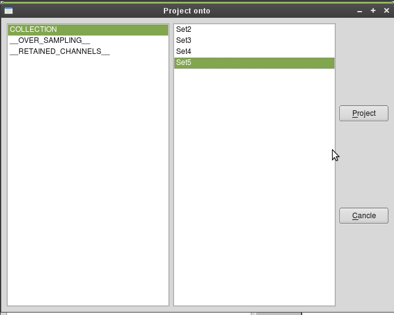

.. _tutorial_performance_results_analysis:

Analyzing performance results
-----------------------------

Performance result collections can be analyzed and visualized in different ways, namely:

 * non-interactively as an operation (:mod:`pySPACE.missions.operations.comp_analysis`)
 * interactively using the script `pySPACE/gui/performance_results_analysis.py`.

.. todo:: Documentation and Visualization of new features
.. todo:: Tutorial for Comp analysis operation (if we get it working with new matplotlib)

The performance results analysis GUI
.....................................
 
The script `pySPACE/gui/performance_results_analysis.py`
invokes first a "choose file" dialog in which the results.csv file 
of the :mod:`PerformanceResultSummary <pySPACE.resources.dataset_defs.performance_result>` has to be selected.
Once a file has been selected, 
the :mod:`PerformanceResultSummary <pySPACE.resources.dataset_defs.performance_result>` is loaded and the main GUI is started.
The main GUI has the following structure:

.. image:: ../graphics/analysis_main_window.png
   :width: 800

In the upper left box, one or two variables can be selected 
whose effect onto a metric shall be analyzed. 
In the lower left box, a metric can be selected. 
Pressing the `Draw`-Button generates a plot with the selected variables 
as axes and the metric as value. 
Pressing the `Histogram`-Button generates a histogram of the value 
the chosen metric takes on. 
The `Load`-Button launches another `choose file`-dialog
that allows to select an other results.csv file.

The `Project onto`-Button creates a pop-up window:

In this pop-up window, one can select a parameter and a certain value for this parameter. 
The `Project`-Button projects the loaded PerformanceResultSummary
onto the subset of items, where the chosen parameter takes on the specified value. 
This is useful if one is e.g. interested in the performance achieved 
on one input collection (when a set of collection has been processed). 
In the example shown in the figure, one would project onto the collection 
"Set5" and ignore the results achieved on the collection "Set2", "Set3", and "Set4". 

As new part, a set of values can be selected for projection
and you get a list of currently made projections in the line above the buttons.

The `Reset`-Button in the main GUI undoes all projection performed.

