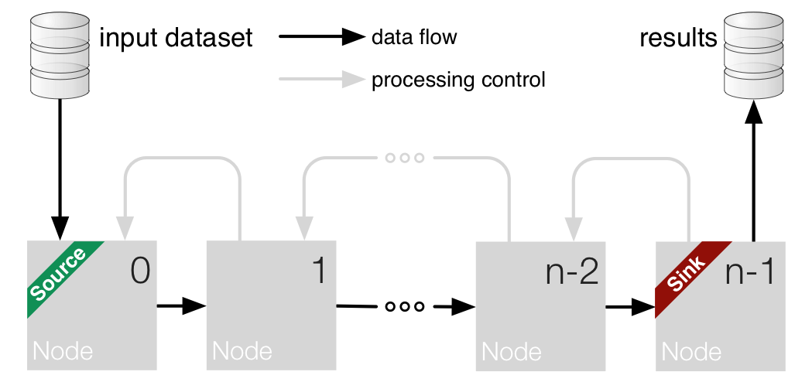
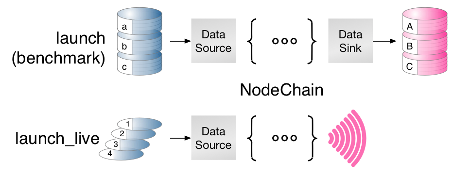

.. _t_new_node:

Writing new nodes
=================

The first step to implementing a new node in `pySPACE` is to design the
algorithm of the node. This is normally a pen-and-paper task which
requires the designer to:

    1) plan the desired algorithm
    2) implement the algorithm using the simplified 'pySPACE' structure.

This process is highly simplified by the inheritance from
:class:`~pySPACE.missions.nodes.base_node.BaseNode`. The new node can thus
choose to inherit a set of common methods and overwrite their content with
the algorithm specific content.

In the following tutorial, we will give a general overview of the methods
available for overwriting in `pySPACE` and discuss good-coding practices
in `pySPACE`. The tutorial itself is accompanied by a hands-on programming
tutorial which is available at :mod:`~pySPACE.missions.nodes.templates`,
on the documentation of the :mod:`~pySPACE.missions.nodes.base_node` as
well as by the :ref:`unit testing tutorial <tutorial_unittesting>` and
the documentation of the :mod:`~pySPACE.tests.generic_unittest.GenericTestCase`.

Contents of the tutorial 
------------------------

    1) `pySPACE architecture`_
    2) `Basic node structure`_
    3) `YAML syntax`_
    4) `Good coding practices`_

pySPACE architecture
--------------------

The first line in each **module/class/function** docstring should be short,
in imperative, without stop and explain, what it does.
You should **not** copy it from elsewhere, because if you overwrite
existing routines, they should be different and such differ in documentation.
If you really can not help copying code, you should at least document,
where you took it from.

Detailed information on documentation guidelines can be found
:ref:`here <doc>`. Before writing your own node, you should have
a look at it, because every node must be documented! You should also
have a look at the documentation of the :mod:`~pySPACE.missions.nodes`
package.

.. note:: Some parts of the guidelines, will be copied to this place,
          because of their importance.

Naming conventions
++++++++++++++++++

The :mod:`~pySPACE.missions.nodes` package supports automatic loading of nodes.
The easiest access then is via the
:mod:`node chains <pySPACE.environments.chains.node_chain>` in the
:mod:`node chain operation <pySPACE.missions.operations.node_chain>`.
Therefore, your newly implemented node needs a name.
To be detected as node, your node has to end with **`Node`**.
Node names are written in CamelCase.
Automatic node names are the class name and the class name without the
ending **Node**.
If you want to have extra names or backward compatibility after changing names,
you can define or extend a dictionary with the name
**_NODE_MAPPING** at the end of each module implementation.
As keys you use the new names and the value is the corresponding class name.
Be careful to use meaningful names or abbreviations, which are not already
:ref:`in use <node_list>`.

When the documentation is generated, the available names are added
automatically to the documentation of each node and additionally
:ref:`complete lists <node_list>` are generated to give information
on available nodes and their functionality.

Base nodes should always include **"Base"** in their class name
and if they are not directly callable they **should not** end with **"Node"**.

Finding the Module
++++++++++++++++++

Before implementing your own node, you should first find out, where to put it.
The :mod:`~pySPACE.missions.nodes` has several modules of algorithms
and you should check their documentation to find out, where your node belongs to.

As the next step, you should find out, if there is already a fitting module in
there, which fits to your algorithm or needs only small change in
documentation, to be fitting.

If there is no module, you have to open up your own new one.

.. warning:: Be careful, when creating new modules. The module name should be
             meaningful. The module should include some basic documentation and
             most importantly describe a general concept of a group
             of algorithms and not repeat the documentation of your new class.
             The integration of node modules and packages into the
             documentation structure happens automatically.

.. note:: When the documentation is generated, at the end of each module
          documentation, a summary of its functions and classes is generated.
          You should not do this manually.

Finding the Class Name
++++++++++++++++++++++

The class name is written with the above mentioned conventions.
It is recommended that, before you start building a new class, you check whether
there is already a class that already implements your desired algorithm. This
does not only prevent redundancy but might also save you a lot of time. It might
also happen that one of the pySPACE classes implements a very similar version of
your algorithm and as such needs only small changes in order to suit your needs.

If you do not manage to find a class that implements your desired algorithms, 
you should check if your algorithm is developed for a very special
purpose but could be generalized. In that case, please consider implementing
the generalized version of the algorithm.

As a last step, you should decide on a short but meaningful algorithm name,
which underlines the main characteristics of your algorithm and differentiates
it from the existing ones.

Base Nodes
++++++++++

For some highly sophisticated types of nodes you can find a corresponding
base node in the package.
The :mod:`~pySPACE.missions.nodes.visualization` package is the best example
in this case.
These nodes define a special interface for their algorithms and you will only
have to implement some special functions for these nodes,
which can be found in their documentation.

Currently the default is, that your node is not inheriting from any special
generalizing base node but only from the basic
:class:`~pySPACE.missions.nodes.base_node.BaseNode`.
When used in a processing chain,
this node is by default just forwarding the data, but implements all
functionality a node needs.

Basic node structure
--------------------

The Main Principle
++++++++++++++++++

Every node, which is no base node should inherit from the base node.

.. code-block:: python

    from pySPACE.missions.nodes.base_node import BaseNode

Implementing a node now is nothing more than a process of carefully overwriting
the default methods of the :class:`~pySPACE.missions.nodes.base_node.BaseNode`.
Depending on the complexity of your algorithm, this might be very easy or a bit
more complicated. 

.. note::

    The :mod:`~pySPACE.missions.nodes.templates` module contains some
    hands-on examples of newly implemented nodes. You should also consult it
    before building new nodes.

The Processed Data Types - Input and Output
+++++++++++++++++++++++++++++++++++++++++++

For processing only, special input and output types are required
which are subclasses of numpy arrays.
All currently available types can be found in
:mod:`pySPACE.resources.data_types`.

The currently available data types are:
:class:`~pySPACE.resources.data_types.time_series.TimeSeries`,
:class:`~pySPACE.resources.data_types.feature_vector.FeatureVector`
and :class:`~pySPACE.resources.data_types.prediction_vector.PredictionVector`.
Once you have decided what type of input and output your node has, it is
recommended to hardcode these possible input and output types into the node
itself.

For input this can be done easily  by setting the ``input_types`` variable
to whatever input your node accepts, e.g.

.. code-block:: python

    input_types = ["TimeSeries", "FeatureVector"]

For the output type, the procedure is fulfilled by overwriting the
:func:`~pySPACE.missions.nodes.base_node.BaseNode.get_output_type` function,
e.g.:

.. code-block:: python

    def get_output_type(self, input_type, as_string=True):
        return self.string_to_class("TimeSeries")

.. warning::

    Since nodes are called via YAML syntax almost automatically, it is
    of the utmost importance that the input and output types of the nodes
    are mentioned inside the code. If the input/output types are not correctly
    set, it might happen that inconsistencies occur when the node is connected
    to a node chain and the wrong input/output is given to a node.

General Concept of a Node
+++++++++++++++++++++++++

The discussion of how to build a node in pySPACE starts from the basic
theoretical constructs of machine learning. What this entails is that,
through pySPACE, on can implement different types of nodes that make use of:

    - supervised or unsupervised learning algorithms,
    - trainable or non-trainable algorithms, or
    - other extension options.

The :mod:`~pySPACE.missions.nodes.base_node.BaseNode` was built such that
it provides dummy methods for all algorithms. For a full list of the available
functions that can be overwritten for an algorithms specific needs,
please consult
the :mod:`Base node documentation <pySPACE.missions.nodes.base_node.BaseNode>`.

A general remark is that nodes are built such that they offer the possibility
of being connected one after the other inside a
:mod:`~pySPACE.environments.chains.node_chain`.

.. image:: ../graphics/node.png
   :width: 500

Integration of Nodes in a :mod:`~pySPACE.environments.chains.node_chain`
+++++++++++++++++++++++++++++++++++++++++++++++++++++++++++++++++++++++++

As mentioned above, the nodes can be connected to one another by means of a
:mod:`~pySPACE.environments.chains.node_chain`. The node chain can be described
by the following whereby input data is sent through a collection of processing
algorithms, each of which brings certain modifications to the original data.

Usage of :mod:`node chains <pySPACE.environments.chains.node_chain>`
++++++++++++++++++++++++++++++++++++++++++++++++++++++++++++++++++++

After the node chain has been constructed, it can be used in 2 different ways
and namely for:

    - benchmark execution, i.e. the test data set is static and saved to disk
    - live execution, i.e. the node receives live data from a transmitter.

Visualization of :mod:`~pySPACE.missions.nodes.splitter` Nodes
++++++++++++++++++++++++++++++++++++++++++++++++++++++++++++++

Another possible use of the new node is as part of a SubNodeChain which
is executed in parallel on the initial dataset.

.. image:: ../graphics/splitter.png
    :width: 500

YAML syntax
-----------

pySPACE was built such that its components could be called through YAML syntax.
Thus, when building a new node, one must take into account that the parameters
passed to the ``__init__`` of the new node will be read inside a YAML call to
the node.

In order to show a theoretical usage of the node, it is of the utmost importance
that, once the node has been written, an Exemplary Call is appended to its
documentation. This not only ensures that future users have an example of how
to use the node but also serves as the basis for testing the functionality of
the node as shall be explained later in `Unit testing`_.

Exemplary calls
+++++++++++++++

An exemplary call to a node is best explained by the means of an example

    .. code-block:: yaml

        -
            node : BLDA_Classifier
            parameters :
                class_labels : ["Target","Standard"]

In the above, one can see the two components that must be part of each
Exemplary Call and namely the name of the node, which is made available
under the ``node`` parameters and the initialization parameters that the node
takes which are made available under a structured YAML dictionary
that bears the name of ``parameters``.

The construct might seem oversimplified but that is exactly the point of using
Exemplary Calls. The user should be able to easily call the nodes and not be
cluttered by excessively long Python syntax.

Node chain
++++++++++

The above principle is then implemented when a node chain operation is called.
A detailed explanation of this process can be found in the dedicated
:ref:`YAML tutorial <yaml>`.

Unit testing
++++++++++++

The exemplary calls are important also due to their necessity in the automated
unit testing framework.
The :mod:`testing framework <pySPACE.tests.generic_unittest.GenericTestCase>`
that pySPACE comes with is built on the **Exemplary Call** of each node.
The testing framework checks the node for the existence of documentation and
looks for the **Exemplary Call**.
In order to test the node, the framework then attempts to run
the **Exemplary Call** and reports the results.

Another important aspect of exemplary calls is that they can be easily used to
check the output of the node given a specific input. This makes the testing of
new nodes an extremely accessible process that requires the user to just
customize the already available scripts.

More on unit testing can be found out in the
:ref:`unit testing tutorial <tutorial_unittesting>`.

Good coding practices
---------------------

PEP8
++++

Before programming a node or overwriting a method, have a look at its
documentation **and** the documentation in the
:class:`~pySPACE.missions.nodes.base_node.BaseNode`, because otherwise
you might get unwanted side effects.
Furthermore, you should have a look at existing code and mainly follow
the `PEP 8 coding style <http://www.python.org/dev/peps/pep-0008/>`_

Further Minor Information
+++++++++++++++++++++++++

* Randomization should be done be setting a fixed seed with the help of
  *self.run_number* to enable reproducibility.
* A special end of a node chain can be a *sink node*.
  It is defined by implementing the method *get_result_dataset*.
  Its function is to gather all data.
* The variable *self.temp_dir* an be used to store some data temporarily,
  e.g., for security reasons.