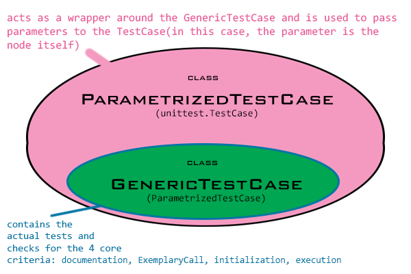

.. _tutorial_unittesting:

Unit testing
************

Best practices, when writing a new node, include building a unit test.
A unit test is a quick and easy way of checking whether the code compiles
and yields the desired results. To aid this process, the
:mod:`~pySPACE.tests.generic_unittest` module should be used.
It enables the user to easily implement his own class-specific unittest.

The ``generic_unittest``
========================

The general idea behind the generic unit test is that all nodes,
regardless of their intended purpose must:

1. have some sort of documentation
2. have an exemplary call
3. initialize without errors
4. execute without errors (regardless of the result)

   Conceptual design of the generic unittest.
   Note that this is *not an inheritance diagram*, but rather a visualization
   of the concept behind the unittest! For the inheritance diagram, please go
   to :mod:`~pySPACE.tests.generic_unittest`.

These four core tests must be passed by any node. Whether the node outputs
the correct result or not, is something that can be tested at a later point
using a node-specific script. In order to run the above tests, the
:mod:`~pySPACE.tests.generic_unittest` module must be imported. The module
contains an implementation of a parametrized unittest which can be used in order
to test different nodes against the four cases mentioned above.

In short, the testing method starts with probing the node for the presence of
documentation. If the documentation is present, the node is subject to the next
test which checks whether the documentation contains a YAML code block which
serves as an exemplary call. If this block is present, the testing suite moves
to the next step which involves testing whether the node can be initialized
with the help of this exemplary call.
If this test also succeeds, the next (and last) step in the generic unittest
is to execute the node using the default data (as defined in
:mod:`~pySPACE.tests.utils.data.test_default_data`). It is worth mentioning that
if one of the lower ranking tests fails e.g. the node has no exemplary call, the
rest of the tests are still run and will yield error(in the previous, the
generic unit test would try to initialize the node and then to execute it.)
This execution is run without a check of the results since the output of each
node is different and, as such, requires node-specific testing methods.

Implementation Example
----------------------

An example where the ``generic_unittest`` was implemented is the
:mod:`~pySPACE.tests.unittests.nodes.feature_generation.test_time_domain_features`
unit test. The testing in this case has two components:

1. The generic unit testing whereby each node is tested with the four testing
   categories mentioned above.
2. The node-specific unit testing whereby specific inputs are fed to the node
   and the output is compared with an analytically computed output.

The first part of the unit testing involved the ``generic_unittest`` module
that is explained above. First, the module to be tested as well as the
``generic_unittest`` module needs to be imported.

.. code-block:: python

    from pySPACE.missions.nodes.feature_generation.time_domain_features import *
    import pySPACE.tests.generic_unittest as gen_test

Since the script tests multiple nodes (that are defined as classes in the same
script), the generic testing must be done for each node separately.
Thus, in this case, we will have 6 ``generic_unittest`` suites, namely:

.. code-block:: python

    suite.addTest(gen_test.ParametrizedTestCase.parametrize(
        current_testcase=gen_test.GenericTestCase, node=TimeDomainFeaturesNode))
    suite.addTest(gen_test.ParametrizedTestCase.parametrize(
        current_testcase=gen_test.GenericTestCase, node=TimeDomainDifferenceFeatureNode))
    suite.addTest(gen_test.ParametrizedTestCase.parametrize(
        current_testcase=gen_test.GenericTestCase, node=SimpleDifferentiationFeatureNode))
    suite.addTest(gen_test.ParametrizedTestCase.parametrize(
        current_testcase=gen_test.GenericTestCase, node=LocalStraightLineFeatureNode))
    suite.addTest(gen_test.ParametrizedTestCase.parametrize(
        current_testcase=gen_test.GenericTestCase, node=LocalPolynomialFeatureNode))
    suite.addTest(gen_test.ParametrizedTestCase.parametrize(
        current_testcase=gen_test.GenericTestCase, node=CustomChannelWiseFeatureNode))

By this, we have just implemented the generic unittests that we talked about
earlier! All that is left to do now is write the node-specific unittests
(which we will not explain here), add them to the testing suite and run the tests.

.. code-block:: python

    suite = unittest.TestLoader().loadTestsFromName('test_time_domain_features')
    unittest.TextTestRunner(verbosity=2).run(suite)

Easy going unit tests by defining the output of the generic unit test
---------------------------------------------------------------------

The ``generic_unittest`` module also provides the user with the possibility of
building on-the-fly unittests in which the output is evaluated.
This can be done in one of the following two ways:

- if the user wants to use the default data set and check the output of
  executing the node on it, the class
  :class:`~pySPACE.tests.generic_unittest.OutputTestCase` can be implemented;
- if the user wants the test to use a user-defined input set and compare this
  against a user-defined output set, the class
  :class:`~pySPACE.tests.generic_unittest.InputOutputTestCase`
  can be implemented.

Both of the classes mentioned will raise errors if the output
-respectively input and output- variables are not defined.
Sample implementations of the InputOutputTestCase can be found in the
unittests for
:mod:`~pySPACE.tests.unittests.nodes.feature_generation.test_time_domain_features`
and :mod:`~pySPACE.tests.unittests.nodes.preprocessing.test_normalization`.

In the case of the first test
(:mod:`~pySPACE.tests.unittests.nodes.feature_generation.test_time_domain_features`),
the source code for the sample implementation is

.. code-block:: python
    
    # initiate the two channels
    channel_names = ['a', 'b']
    array = []
    # fill in the data points according to a pre set equation
    for counter in range(100):
        array.append([4*counter+1, 4.36*counter-23.4])
    initial_data = TimeSeries(array, channel_names, 100)
    suite.addTest(gen_test.ParametrizedTestCase.parametrize(
        current_testcase=gen_test.InputOutputTestCase,
        node=LocalStraightLineFeatureNode,
        input=[[[initial_data]]],
        output=FeatureVector([4., 1.,  -23.4, 4.36],
                             feature_names=['LSFSlope_a_0.000sec_1.000sec',
                                            'LSFOffset_a_0.000sec_1.000sec',
                                            'LSFOffset_b_0.000sec_1.000sec',
                                            'LSFSlope_b_0.000sec_1.000sec'])
    ))
  
This particular node performs a linear regression on ``TimeSeries`` data
and returns ``FeatureVectors`` containing the slope and offset yielded by the
regression. In order to test the node, we build a data set which obeys a
linear formula and perform the linear regression on it.

The second example, located at
:mod:`~pySPACE.tests.unittests.nodes.preprocessing.test_normalization`
involves the localized Z-score normalization of a ``TimeSeries`` object.
The source code for the implementation of the ``InputOutputTestCase`` is

.. code-block:: python

    # the following is an example of how the InputOutputTestCase can be implemented
    # for a TimeSeriesOutput in the case of the LocalStandardizationNode
    initial_data = TimeSeries([[1., -1.], [1., -1.], [-1., 1.], [-1., 1.]],
                       channel_names=["C3", "C4"], sampling_frequency=1.0,
                       start_time=0.0, end_time=3.0)

    suite.addTest(gen_test.ParametrizedTestCase.parametrize(
        current_testcase=gen_test.InputOutputTestCase,
        node=normalization.LocalStandardizationNode,
        input=[[[initial_data]]],
        output=initial_data
    ))

The principle behind this particular test is that the input is already
normalized and as such should be the same as the output.
In both cases, the dimensions of the input are of particular importance,
hence the square brackets surrounding the input ``[[[initial_data]]]``.

Using the script as a command line executable
---------------------------------------------

Running the :mod:`~pySPACE.tests.generic_unittest` script from the command line
will execute the generic unittests on all the available nodes. 

The script itself comes with the possibility of **verbose**
output as well as with the option of testing a single node. If for whatever
reason, the user decides that the output should be printed to the terminal screen,
this can be attained by calling the script using:

::

    ./generic_unittest.py -v

This will print the error messages to the terminal ''stdout''. Along with the output,
the verbose mode produces a piechart plot of the results saved in the file
``generic_unittest_plot.pdf``. An example of such a plot is given below

.. figure:: ../graphics/generic_unittest_plot.png
   :align: center
   :figwidth: 800 px
   :width: 800

   Example output of running the ``generic_unittest.py`` script from the command line

Another command line application of :mod:`~pySPACE.tests.generic_unittest`
script is the testing of a singular node. The node can be called using the
``-sn SINGLENODE`` option. A concrete example of this would be:

::

    ./generic_unittest.py -v -sn SorSvmNode

The node is called based on the key that it is represented by in the default
node mapping.

The default option of running the unittests and to evaluate the output is by
the generation of an ``.html`` report that contains the results in a comfortable,
human-readable form. This is done by simply calling 

::

    ./generic_unittest.py -r

from the command line. Executing the script suing this option will start a backend
parser and test runner, called :mod:`~pySPACE.tests.HTMLTestRunner` which executes
the tests and outputs the results in HTML format.

For more help regarding the usage of the script, type::

    ./generic_unittest.py -h

on the command line.